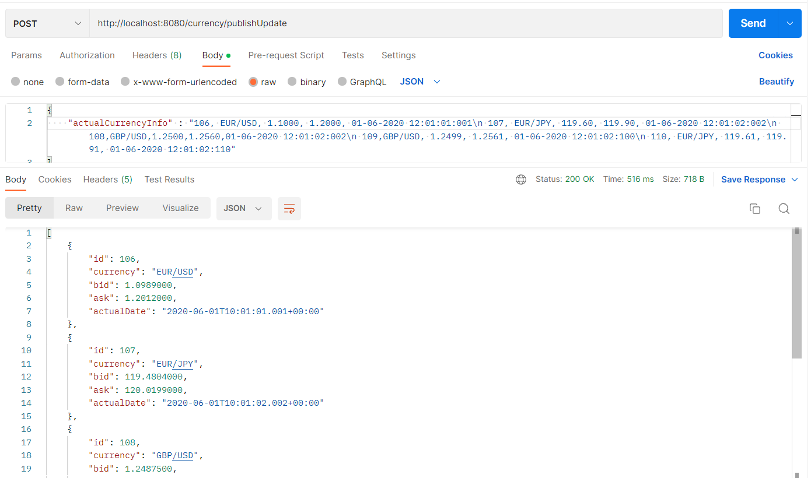
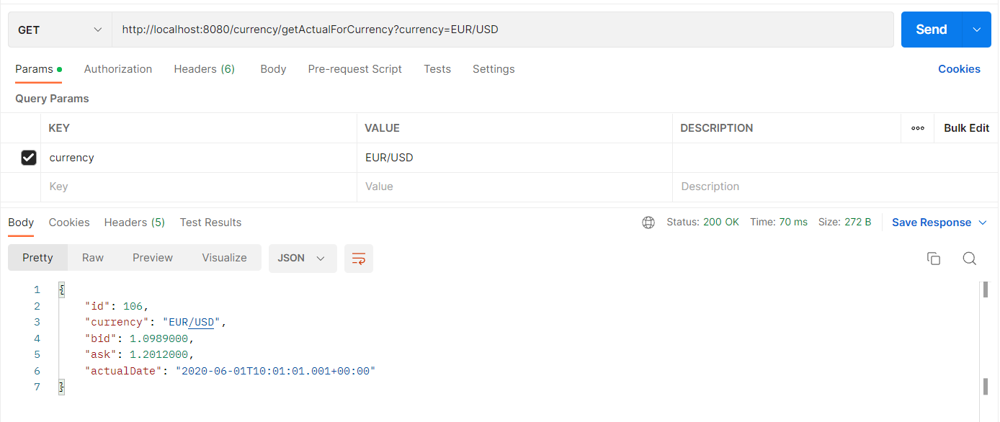
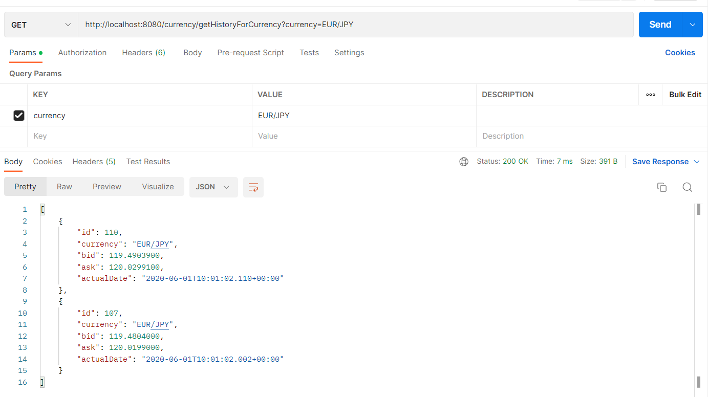

### Application to  calculate bid-ask & actions with fx details

Used technologies:
#### - Spring boot
#### - Spring web
#### - Apache Kafka
#### - H2 database

In order to test all functionalities of application you can just run the tests in 
package: *src/test/java/pl/santander/banking*

If you want to run the application, you need to install zookeeper, kafka

Endpoints to test with postman:
##### POST http://localhost:8080/currency/publishUpdate: 
- accept csv string, publish event. Internally will catch topic, process the data, make calculations and save them to database

##### GET http://localhost:8080/currency/getActualForCurrency:
- accept currency format string, will return the latest details for this currency

##### GET http://localhost:8080/currency/getHistoryForCurrency:
- accept currency format string, will return all details in database related to this currency with ordered by date

